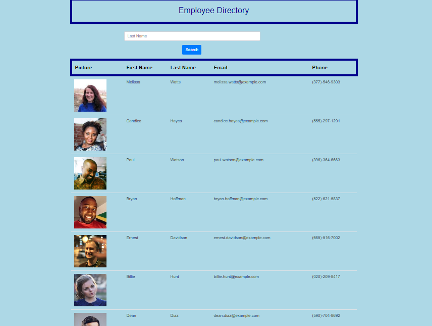

# User-Directory

##  Homework 19

## Instructions

Whent clients type their first name, the API searches for people with first name.

## User Story

As a user, I want to be able to view my entire employee directory at once so that I have quick access to their information.

## Business Context

An employee or manager would benefit greatly from being able to view non-sensitive data about other employees. It would be particularly helpful to be able to filter employees by name.

## Snapshot

## Github page

- https://anna250481.github.io/User-Directory/.

- https://github.com/Anna250481/User-Directory

